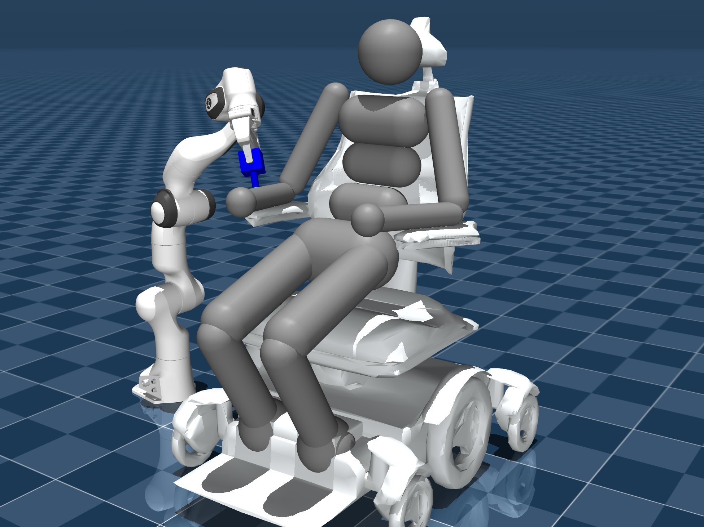
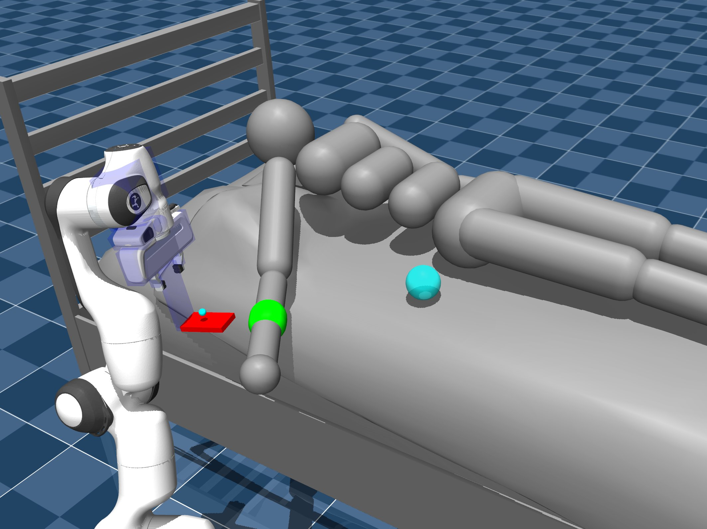

# 🦾 Assistax 

[Paper Link](https://arxiv.org/abs/2507.21638) 

<div style="display: flex; justify-content: space-between;">
  
  
  
</div>

Assistax is a Python library that provides hardware-accelerated environments in the domain of assistive robotics together with accompanying baseline algorithm implementations. We utilize JAX and Brax for quick RL and MARL training pipelines.

## 🏄 Installation

We use `uv` for environment and package management. We highly recommend using `uv` when working with this project. For installing `uv`, see [uv installation](https://docs.astral.sh/uv/getting-started/installation/), and for more information and further documentation, see [uv docs](https://docs.astral.sh/uv/).

1. Clone the repository
```bash
git clone https://github.com/assistive-autonomy/assistax.git
```

2. Install all packages with uv
```bash
cd assistax
uv sync && uv pip install -e .
```

## 🚀 Quick Start

### 🏋️‍♀️ Run one of the baselines

```bash
uv run python assistax/baselines/IPPO/ippo_run.py ENV_NAME=scratchitch
```

Outputs are saved to a new directory which is created inside the algorithm-specific directory (e.g., `assistax/baselines/IPPO/outputs`). This will contain: 1. **results** as a `.npy` file, 2. **renders** as `.html` files, 3. **parameters** of trained models as `.safetensors`.

### 🎓 Generating multiple partner policies

```bash
uv run python assistax/baselines/IPPO/ippo_zoo_gen.py ENV_NAME=scratchitch
```

This will create a `zoo` directory where configs and parameters used during training are stored. You can add pre-trained partners trained by multiple different algorithms to this `zoo` directory.

### 👯 Training for ZSC

```bash
uv run python assistax/baselines/ZSC/ppo_aht.py ENV_NAME=scratchitch
```

This will run a ZSC experiment for a single PPO robot agent against the pre-trained partner policies in the zoo. Check the config `{alg}_aht.yaml`. By default, this will do a 50-50 train-test split of the pre-trained partner agent population.

### ⚔️ Crossplay of agent population

```bash
uv run python assistax/baselines/crossplay_zoo.py ENV_NAME=scratchitch
```

This will generate crossplay returns which can be used to create crossplay matrices to check for diversity among the population's learned policies. Note that this currently will not generate any renders.

### 🧹 Sweeps

```bash
uv run python assistax/baselines/IPPO/ippo_sweep.py ENV_NAME=scratchitch
```

This will generate a sweep for the specified IPPO variant for the scratchitch task. You can run larger sweeps by utilizing Hydra's multirun feature (see the Hydra documentation for more details).

## 🦓 Pre-trained partner policies 

The pre-trained partner policies `zoo` can be downloaded on [Hugging Face](https://huggingface.co/datasets/leohink/assistax-zoo/). Downlaod the `zoo.tar.gz` file and change the `ZOO_PATH` config in `assistax/baselines/ZSC/config/ppo_aht.yaml` to train a 50-50 split agains a pre-trained population of "human" agents. 

## 🥱 Other information

- We use Hydra for managing configuration and training runs. For more information, see the [Hydra docs](https://hydra.cc/docs/intro/).
- We rely on Mujoco's MJX as a physics engine you may wish to tune performance by setting the following XLA environment variable `XLA_FLAGS=--xla_gpu_triton_gemm_any=true` (see [MJX docs](https://mujoco.readthedocs.io/en/stable/mjx.html#gpu-performance))
- If you run into memory issues please try trouble shooting by setting environment variables in accordance to the [JAX docs](https://docs.jax.dev/en/latest/gpu_memory_allocation.html). 

## 🏝️ Environments

- **Scratch**: A scratching target is randomly sampled on the surface of the human's right arm. The robot must move its end-effector to this position and apply a specified force. The human can move their arm to make the target more accessible to the robot. [implementation](assistax/envs/scratchitch.py)

- **Bed Bath**: We provide target bathing points distributed along the surface of the human's arm. The robot must reach each point and apply a certain force to activate the next point. The aim is to reach (wipe) all points before the end of an episode. [implementation](assistax/envs/bedbathing.py)

- **Arm Assist**: The robot must help the human lift their right arm back into a comfortable position on the bed. In this task, the human is too weak to complete the task on their own and thus requires the robot. The robot has to learn to align its end-effector with a target section of the arm, and then move the human's arm until the green and blue targets overlap. [implementation](assistax/envs/armmanipulation.py)

## 📈 Baselines 

| Algorithm | FF | PS | NPS | RNN |
|-----------|----|----|----|----|
| IPPO    | ✅ | ✅ | ✅ | ✅ | 
| MAPPO  | ✅ | ✅ | ✅ | ✅ | 
| ISAC   | ✅  | ❌ | ✅ | ❌ |
| MASAC  | ✅  | ❌ | ✅ | ❌ |

## Related 

Some relavant repo's you should check out!

- [JaxMARL](https://github.com/FLAIROx/JaxMARL/tree/v0.0.5)
- [MAVA](https://github.com/instadeepai/Mava?tab=readme-ov-file)
- [gymnax](https://github.com/RobertTLange/gymnax)
- [JaxRobotarium](https://github.com/GT-STAR-Lab/JaxRobotarium)  

## Citation

If you use Assistax in your work please cite it as:

```
@misc{hinckeldey2025assistaxhardwareacceleratedreinforcementlearning,
      title={Assistax: A Hardware-Accelerated Reinforcement Learning Benchmark for Assistive Robotics}, 
      author={Leonard Hinckeldey and Elliot Fosong and Elle Miller and Rimvydas Rubavicius and Trevor McInroe and Patricia Wollstadt and Christiane B. Wiebel-Herboth and Subramanian Ramamoorthy and Stefano V. Albrecht},
      year={2025},
      eprint={2507.21638},
      archivePrefix={arXiv},
      primaryClass={cs.AI},
      url={https://arxiv.org/abs/2507.21638}, 
}
```

## TODOS 

- [ ] Homogonize the configs e.g. have `rl.gamma` instead of `GAMMA`.
- [ ] Add more detailed docs to `assistax/baselines`.
- [ ] Add a **collaborate** section to the docs. 


