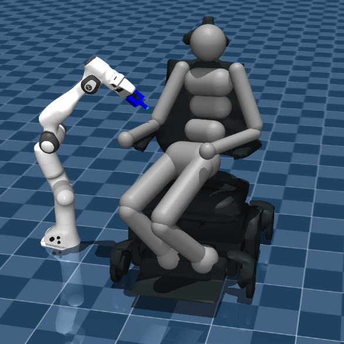
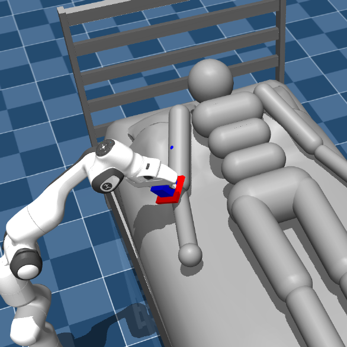
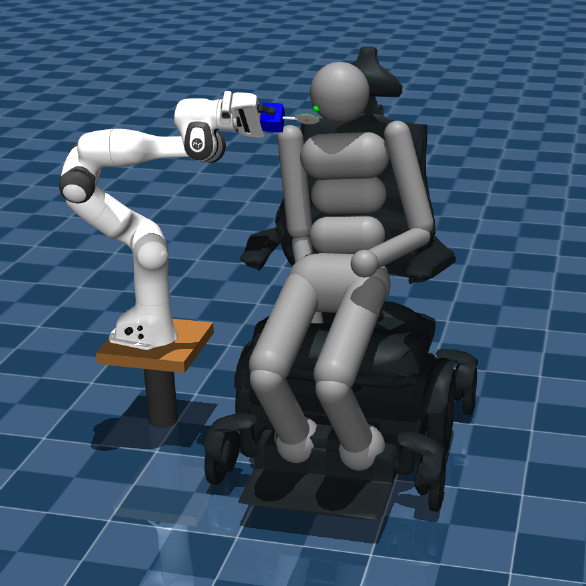
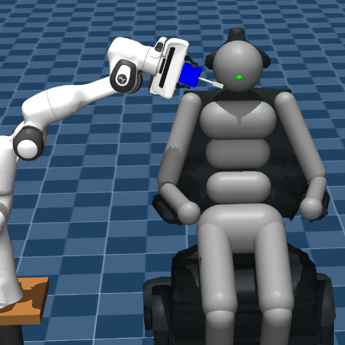
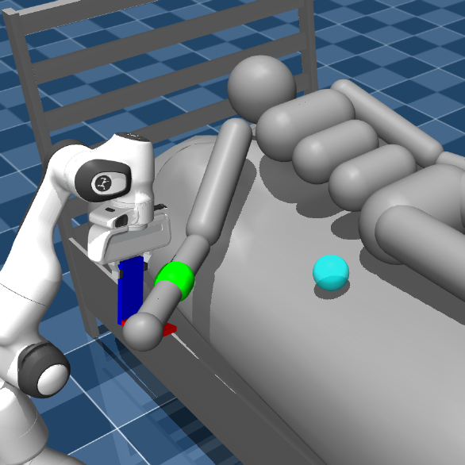

# 🦾 Assistax 

[Paper Link](https://arxiv.org/abs/2507.21638) 

<div style="display: flex; justify-content: space-between;">
  
  
  
  
  
</div>

Assistax is a Python library that provides hardware-accelerated environments in the domain of assistive robotics together with accompanying baseline algorithm implementations. We utilize JAX and Brax for quick RL and MARL training pipelines.

## 🏄 Installation

### As a library (pip)

To use the assistax **environments** in your own project, install the package directly from GitHub (the MuJoCo/MJX assets are bundled):

```bash
# NVIDIA GPU (CUDA 12); use [cuda13] or [cpu] as appropriate
pip install "assistax[cuda12] @ git+https://github.com/assistive-autonomy/assistax.git"
```

This gives you the environments (`assistax.make`, `assistax.envs.create`) and wrappers — see the **Using assistax in Python** section below. The **baselines** (training scripts) are run from a clone, as described next.

### For development & running the baselines (uv)

We use `uv` for environment and package management. We highly recommend using `uv` when working with this project. For installing `uv`, see [uv installation](https://docs.astral.sh/uv/getting-started/installation/).

1. Clone the repository
```bash
git clone https://github.com/assistive-autonomy/assistax.git
```

2. Install all packages with uv 

*If you have a NVIDIA GPU*
```bash
cd assistax
uv sync --dev --extra cuda12 # if your using cuda12 else cuda13 
```

*Otherwise for CPU*

```bash
cd assistax
uv sync --dev --extra cpu 
```

## 🐍 Using assistax in Python

Create an environment with `assistax.make` and step it with the functional (JAX) API. Observations, rewards and dones are dicts keyed by agent name (`rewards`/`dones` also carry an `"__all__"` entry); actions are `Box(-1, 1)` per actuator:

```python
import jax
import jax.numpy as jnp
import assistax

env = assistax.make("scratchitch")          # one of assistax.registered_envs
key = jax.random.PRNGKey(0)

obs, state = env.reset(key)                  # obs: {agent: array}
actions = {a: jnp.zeros(env.action_spaces[a].shape) for a in env.agents}
obs, state, rewards, dones, info = env.step(key, state, actions)
```

Enable **preference rewards** (or `disability` / `sparse_rewards`) by passing the corresponding dict — `make` forwards it to `assistax.envs.create`:

```python
env = assistax.make(
    "feeding",
    preference_rewards={
        "preference_weights": {"speed_preference": 0.25, "force_preference": 0.35},
        "preference_ranges": {"speed_range": [0.06, 0.14], "force_range": [1.5, 3.5]},
        "reward_budget": 1.0,
    },
)
```

See [`assistax/envs/README.md`](assistax/envs/README.md) for the full per-environment reference (observations, reward components, the preference system).

> **Note:** `pip install` gives you the **environments**. The **baselines** (IPPO/MAPPO/ISAC/MASAC/ZSC training scripts under `assistax/baselines/`) are research scripts run from a clone — they use Hydra configs and per-directory imports. Before running them, set your own values for `ENTITY`/`PROJECT` (Weights & Biases), `ZOO_PATH`, and `DEVICE`/`GPU_ENV_CAPACITY` in the relevant `config/*.yaml`.

## 🚀 Quick Start

### 🏋️‍♀️ Run one of the baselines

```bash
uv run python assistax/baselines/IPPO/ippo_run.py ENV_NAME=scratchitch
```

Outputs are saved to a new directory which is created inside the algorithm-specific directory (e.g., `assistax/baselines/IPPO/outputs`). This will contain: 1. **results** as a `.npy` file, 2. **renders** as `.html` files, 3. **parameters** of trained models as `.safetensors`.

### 🎓 Generating multiple partner policies

```bash
uv run python assistax/baselines/IPPO/ippo_zoo_gen.py ENV_NAME=scratchitch
```

This will create a `zoo` directory where configs and parameters used during training are stored. You can add pre-trained partners trained by multiple different algorithms to this `zoo` directory.

### 👯 Training for ZSC

```bash
uv run python assistax/baselines/ZSC/ppo_aht.py ENV_NAME=scratchitch
```

This will run a ZSC (ad-hoc teamwork) experiment for a single PPO robot agent against the pre-trained partner policies in the zoo. Check the config `{alg}_aht.yaml`. By default this does a 50-50 train-test split of the pre-trained partner population, so generalisation to *unseen* partners can be measured. You can instead stratify partners by their preferences using the extreme-split option (see `assistax/baselines/ZSC/aht_utils.py`). Pair this with the crossplay step below to build crossplay matrices over the population.

### ⚔️ Crossplay of agent population

```bash
uv run python assistax/baselines/crossplay_zoo.py ENV_NAME=scratchitch
```

This will generate crossplay returns which can be used to create crossplay matrices to check for diversity among the population's learned policies. Note that this currently will not generate any renders.

### 🧹 Sweeps

```bash
uv run python assistax/baselines/IPPO/ippo_sweep.py ENV_NAME=scratchitch
```

This will generate a sweep for the specified IPPO variant for the scratchitch task. You can run larger sweeps by utilizing Hydra's multirun feature (see the Hydra documentation for more details).

## 🦓 Pre-trained partner policies 

The pre-trained partner policies `zoo` can be downloaded on [Hugging Face](https://huggingface.co/datasets/leohink/assistax-zoo/). Downlaod the `zoo.tar.gz` file and change the `ZOO_PATH` config in `assistax/baselines/ZSC/config/ppo_aht.yaml` to train a 50-50 split agains a pre-trained population of "human" agents. 

## 💡 Running Experiments **Tip**

When running experiments the hydra config automatically creates an EXP ID based on the time but if you are using multiruns it maybe nice to have the same EXP_ID for all experiments that are launched with the multirun. To achieve this simply set the `EXP_ID` as an environment variable e.g., run:

```bash
EXP_ID=$(date +%Y-%m-%d_%H-%M-%S) python ippo_run.py -m SEED=0,1,2,3,4
```

or if you are using slurm or another launch script add the following:

```bash
export EXP_ID=$(date +%Y-%m-%d_%H-%M-%S)
```


## 🥱 Other information

- We use Hydra for managing configuration and training runs. For more information, see the [Hydra docs](https://hydra.cc/docs/intro/).
- We rely on Mujoco's MJX as a physics engine you may wish to tune performance by setting the following XLA environment variable `XLA_FLAGS=--xla_gpu_triton_gemm_any=true` (see [MJX docs](https://mujoco.readthedocs.io/en/stable/mjx.html#gpu-performance))
- If you run into memory issues please try trouble shooting by setting environment variables in accordance to the [JAX docs](https://docs.jax.dev/en/latest/gpu_memory_allocation.html). 

## 🏝️ Environments

- **Scratch**: A scratching target is randomly sampled on the surface of the human's right arm. The robot must move its end-effector to this position and apply a specified force. The human can move their arm to make the target more accessible to the robot. [implementation](assistax/envs/scratchitch.py)

- **Bed Bath**: We provide target bathing points distributed along the surface of the human's arm. The robot must reach each point and apply a certain force to activate the next point. The aim is to reach (wipe) all points before the end of an episode. [implementation](assistax/envs/bedbathing.py)

- **Feeding**: The robot must guide a spoon to the human's mouth. It has to approach with the correct orientation and a gentle, well-paced motion so that contact with the human is comfortable. [implementation](assistax/envs/feeding.py)

- **Teeth Brushing**: The robot must bring a toothbrush to the human's mouth and brush their teeth. This requires approaching and aligning the brush, then maintaining an appropriate brushing motion and contact force. [implementation](assistax/envs/teethbrushing.py)

- **Arm Assist**: The robot must help the human lift their right arm back into a comfortable position on the bed. In this task, the human is too weak to complete the task on their own and thus requires the robot. The robot has to learn to align its end-effector with a target section of the arm, and then move the human's arm until the green and blue targets overlap. [implementation](assistax/envs/armmanipulation.py)

## 🎚️ Preference rewards

Each environment's reward can be augmented with **human-preference** components via the `PreferenceRewardWrapper` ([implementation](assistax/wrappers/training.py)). This lets the "human" express preferences over *how* a task is completed — for example a preferred end-effector **speed** and **contact force**, each rewarded over a configurable range. Preference rewards are added on top of the base task reward, so the robot has to satisfy the task *and* the human's preferences.

Enable them by uncommenting the `preference_rewards` block under `ENV_KWARGS` in the algorithm config (see `assistax/baselines/IPPO/config/ippo.yaml`), then run as usual:

```bash
uv run python assistax/baselines/IPPO/ippo_run.py ENV_NAME=feeding
```

Preference weights and ranges can also be swept and sampled when generating partner populations for zero-shot coordination (see the *Generating multiple partner policies* section above).

## 📈 Baselines 

| Algorithm | FF | PS | NPS | RNN |
|-----------|----|----|----|----|
| IPPO    | ✅ | ✅ | ✅ | ✅ | 
| MAPPO  | ✅ | ✅ | ✅ | ✅ | 
| ISAC   | ✅  | ❌ | ✅ | ❌ |
| MASAC  | ✅  | ❌ | ✅ | ❌ |

## Related 

Some relavant repo's you should check out!

- [JaxMARL](https://github.com/FLAIROx/JaxMARL/tree/v0.0.5)
- [MAVA](https://github.com/instadeepai/Mava?tab=readme-ov-file)
- [gymnax](https://github.com/RobertTLange/gymnax)
- [JaxRobotarium](https://github.com/GT-STAR-Lab/JaxRobotarium)  

## Citation

If you use Assistax in your work please cite it as:

```
@misc{hinckeldey2025assistaxhardwareacceleratedreinforcementlearning,
      title={Assistax: A Hardware-Accelerated Reinforcement Learning Benchmark for Assistive Robotics}, 
      author={Leonard Hinckeldey and Elliot Fosong and Elle Miller and Rimvydas Rubavicius and Trevor McInroe and Patricia Wollstadt and Christiane B. Wiebel-Herboth and Subramanian Ramamoorthy and Stefano V. Albrecht},
      year={2025},
      eprint={2507.21638},
      archivePrefix={arXiv},
      primaryClass={cs.AI},
      url={https://arxiv.org/abs/2507.21638}, 
}
```

## TODOS 

- [ ] Homogonize the configs e.g. have `rl.gamma` instead of `GAMMA`.
- [ ] Add more detailed docs to `assistax/baselines`.
- [ ] Add a **collaborate** section to the docs. 


